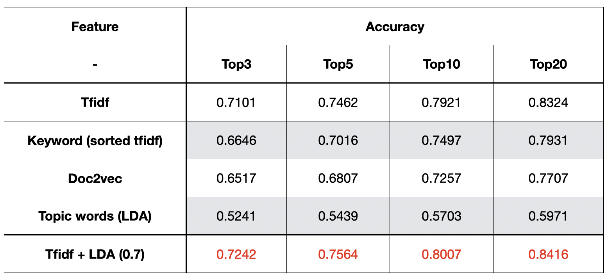

### 任务介绍：
    1. 公众号分类任务，判断其是否属于广告公众号。
    2. 公众号相似度匹配任务。

### 数据集：
    训练集：data/data.xlsx 2862条数据，1为广告，0非广告。

### 预训练模型：
    Bert: 下载bert已训练好的模型文件 -- chinese_L-12_H-768_A-12
    trained-word2vec-model: 训练好的词向量
    trained-LDA-model: 训练好的LDA模型

### 方法：
    分类模型：Bert
    相似度建模：tfidf, doc2vec, keywords embedding, LDA, tfidf+LDA
    相似度计算：MIPS, LSH
    
### 模型效果：
    1. Bert分类模型的accuracy, recall, precision均在85%以上。
    2. 相似度建模效果对比: top3, 5, 10, 20 accuracy (文章数量：10000，公众号数量：6101) (参考embedding.png)。
   
    3. 相似度计算速度对比：MIPS：0:06:49 LSH: 0:54:15
    4. 数据量增加建模效果越好（参考accuracy.png）。
    

### 文件说明
    load_data.py: 训练数据加载
    model_train.py: 训练Bert分类模型
    ad_classify.py: 给数据打标签
    kol_sim_python.py: python版本相似度计算
    kol_sim_spark.py: spark版本相似度计算
    

### 环境依赖
    python部分：python3 -m pip install -r ./requirements.txt -i http://mirrors.aliyun.com/pypi/simple --trusted-host mirrors.aliyun.com
    spark部分：安装openjdk，配置java环境

### 数据库说明
    kol库下三个表：kol_similar, kol_content, kol_article

### 执行方式
    手动执行
